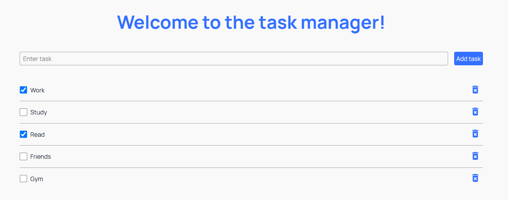

#  ToDo List App

This ToDo List application allows users to manage their daily tasks efficiently.
Users can add new tasks, delete existing ones, and toggle their status between
completed and not completed. It's a simple and effective tool for staying
organized.

## 🖼️ Preview

## 📚 Features

- ✅ Add new tasks – quickly add items to your list.
- 🗑️ Delete tasks – remove tasks you no longer need.
- 🔁 Toggle task status – mark as completed or not completed.
- 🎯 User-friendly interface – clean and intuitive design.

## 🛠️ Technologies Used

- **React:** ⚛️ JavaScript library for building user interfaces.
- **Vite:** ⚡ Next-generation frontend tooling for fast development.
- **React Redux:** 📦 Predictable state management for React applications.
- **Redux Persist:** 💾 Persist and rehydrate your Redux store.
- **Axios:** 🌐 Promise-based HTTP client for making API requests.
- **Formik:** 📋 Easy form state management.
- **Yup:** ✅ Schema builder for value parsing and validation.
- **react-hot-toast:** 🍞 Elegant and simple toast notifications for React.
- **react-spinners:** ⏳ A collection of loading indicators for React.
- **react-icons:** 🎨 Ready-to-use icon library.
- **modern-normalize:** 🧼 Normalize browser defaults for consistent styling.
- **Vercel:** 🚀 Deployed and hosted on [Vercel](https://vercel.com/).

## 🔗 Project Resources

- **Live App:** 🌐 [ToDo List](https://true-item-test-task-frontend.vercel.app/)
- **Backend API:** 🛠️
  [ToDo List API](https://true-item-test-task-backend.onrender.com/)

## 📦 Setup Instructions

1. Clone the Repository:
   `git clone https://github.com/your-repo/true-item-test-task-frontend.git`

2. Navigate to the project folder: `cd true-item-test-task-frontend`

3. Install Dependencies: `npm install`

4. Run the development server: `npm run dev`

5. Open the app in your browser at `http://localhost:3000`

## 🖋️ Author

Mariia Ostapets, Fullstack developer

[LinkedIn](https://www.linkedin.com/in/mariia-ostapets/) |
[GitHub](https://github.com/Mariia-Ostapets)
